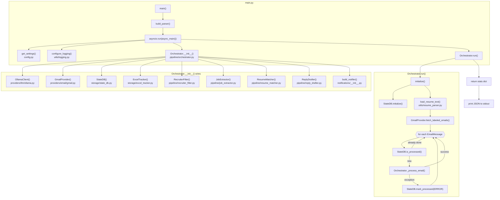
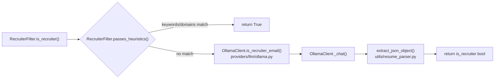
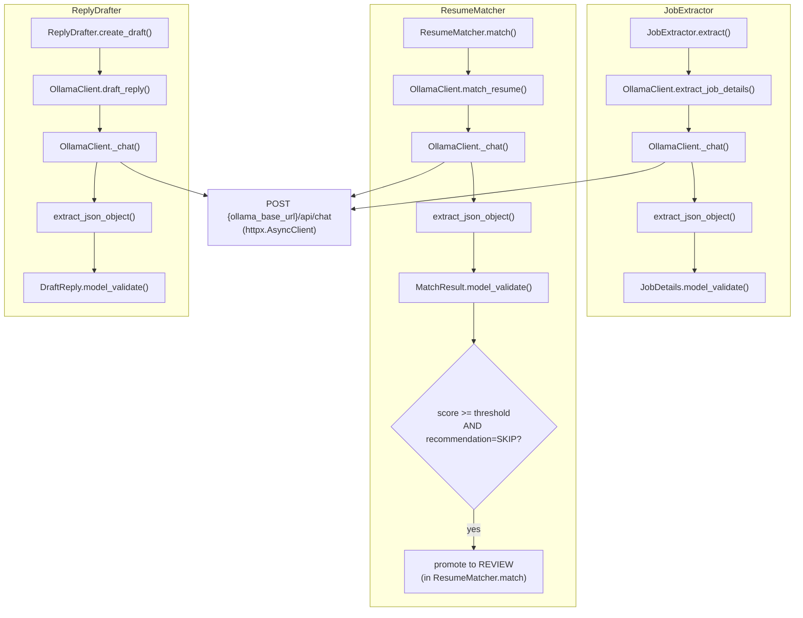
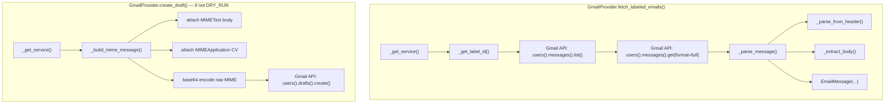
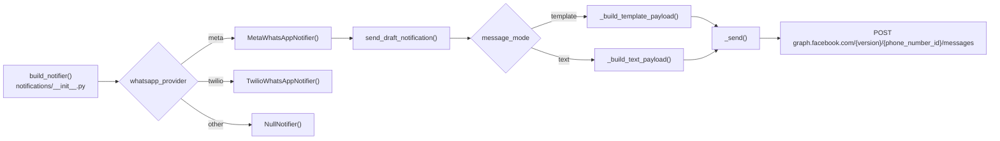
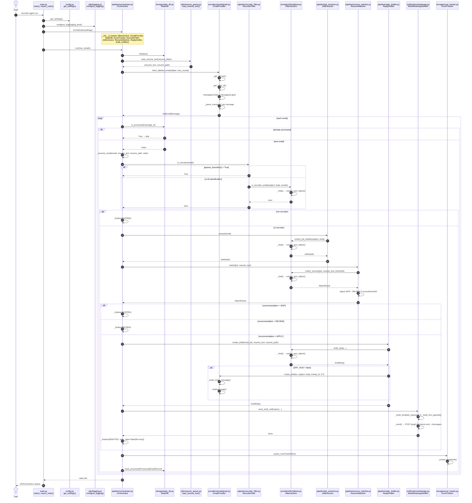
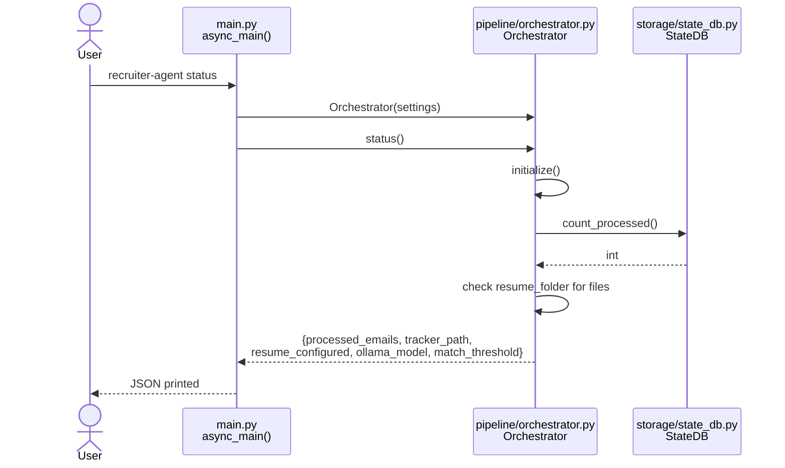
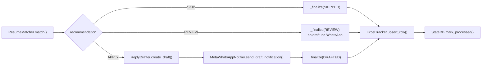
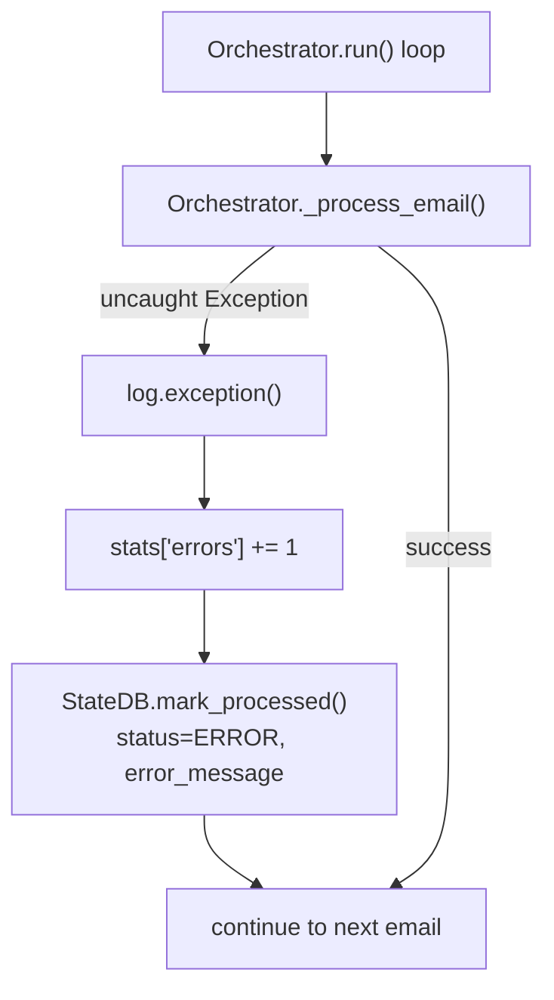

# Recruiter Agent — Architecture

Detailed flow and sequence diagrams mapped to actual source files and functions.

---

## 1. High-level system flow (`recruiter-agent run`)



---

## 2. Per-email processing flow (`Orchestrator._process_email`)

```mermaid
flowchart TD
    START(["Orchestrator._process_email()"]) --> INC["stats['processed'] += 1"]

    INC --> FILTER{"RecruiterFilter.is_recruiter()<br/>pipeline/recruiter_filter.py"}

    FILTER -->|False| FIN_SKIP1["Orchestrator._finalize()<br/>status=SKIPPED, score=0"]

    FILTER -->|True| EXTRACT["JobExtractor.extract()<br/>pipeline/job_extractor.py"]
    EXTRACT --> MATCH["ResumeMatcher.match()<br/>pipeline/resume_matcher.py"]

    MATCH --> REC{{"match.recommendation"}}

    REC -->|SKIP| FIN_SKIP2["Orchestrator._finalize()<br/>status=SKIPPED"]
    REC -->|REVIEW| FIN_REVIEW["Orchestrator._finalize()<br/>status=REVIEW"]
    REC -->|APPLY| DRAFT["ReplyDrafter.create_draft()<br/>pipeline/reply_drafter.py"]

    DRAFT --> WA["Notifier.send_draft_notification()<br/>notifications/whatsapp.py"]
    WA --> FIN_DRAFT["Orchestrator._finalize()<br/>status=DRAFTED<br/>reply_date=StateDB.now()"]

    FIN_SKIP1 --> FINALIZE
    FIN_SKIP2 --> FINALIZE
    FIN_REVIEW --> FINALIZE
    FIN_DRAFT --> FINALIZE

    subgraph FINALIZE["Orchestrator._finalize()"]
        FINALIZE --> T1["ExcelTracker.upsert_row()<br/>storage/excel_tracker.py"]
        FINALIZE --> T2["StateDB.mark_processed()<br/>storage/state_db.py"]
    end

    FINALIZE --> END(["return"])
```

---

## 3. Recruiter filter detail



Heuristic keywords and domains are loaded from `config/settings.yaml` via `Settings.model_post_init()` in `config.py`.

---

## 4. LLM call chain (Ollama / DeepSeek R1)



---

## 5. Gmail fetch & draft detail



OAuth is handled in `_get_service()`: reads `token.json`, refreshes expired tokens, or runs `InstalledAppFlow.run_local_server()` using `credentials.json`.

---

## 6. WhatsApp notification detail (Meta default)



---

## 7. Sequence diagram — full `recruiter-agent run`



---

## 8. Sequence diagram — `recruiter-agent status`



---

## 9. Match recommendation → action



`APPLY` is returned by `OllamaClient.match_resume()` when score ≥ `MATCH_THRESHOLD` (default 70). `ResumeMatcher.match()` additionally promotes `SKIP` → `REVIEW` when score ≥ threshold but the LLM said `SKIP`.

---

## 10. File → class → key functions reference

| Source file | Class / function | Role |
|-------------|------------------|------|
| `main.py` | `main()`, `async_main()`, `build_parser()` | CLI entry |
| `config.py` | `get_settings()`, `Settings` | Load `.env` + `config/settings.yaml` |
| `pipeline/orchestrator.py` | `Orchestrator.run()`, `_process_email()`, `_finalize()` | Main coordinator |
| `pipeline/recruiter_filter.py` | `RecruiterFilter.is_recruiter()`, `passes_heuristics()` | Filter recruiter emails |
| `pipeline/job_extractor.py` | `JobExtractor.extract()` | Extract job details |
| `pipeline/resume_matcher.py` | `ResumeMatcher.match()` | Score resume vs job |
| `pipeline/reply_drafter.py` | `ReplyDrafter.create_draft()` | LLM reply + Gmail draft |
| `providers/llm/ollama.py` | `OllamaClient._chat()`, `extract_job_details()`, `match_resume()`, `draft_reply()`, `is_recruiter_email()` | DeepSeek R1 via Ollama |
| `providers/email/gmail.py` | `GmailProvider.fetch_labeled_emails()`, `create_draft()` | Gmail read + draft |
| `utils/resume_parser.py` | `load_resume_text()`, `extract_json_object()` | Read CV + parse LLM JSON |
| `storage/state_db.py` | `StateDB.is_processed()`, `mark_processed()` | Idempotency (SQLite) |
| `storage/excel_tracker.py` | `ExcelTracker.upsert_row()` | Excel tracking |
| `notifications/__init__.py` | `build_notifier()` | Pick Meta / Twilio / Null |
| `notifications/whatsapp.py` | `MetaWhatsAppNotifier.send_draft_notification()` | WhatsApp alert |
| `models/domain.py` | `EmailMessage`, `JobDetails`, `MatchResult`, `DraftReply`, `TrackerRow` | Domain models |

---

## 11. External dependencies per run

| Service | Used by | Purpose |
|---------|---------|---------|
| Gmail API | `GmailProvider` | Fetch labeled emails, create drafts |
| Ollama (Docker) | `OllamaClient` | Job extraction, matching, reply drafting, recruiter classification |
| Meta Graph API | `MetaWhatsAppNotifier` | WhatsApp draft alerts |
| SQLite (`data/state/agent.db`) | `StateDB` | Processed email deduplication |
| Excel (`data/tracker/recruiter_tracker.xlsx`) | `ExcelTracker` | Recruiter interaction log |
| Resume file (`data/resume/`) | `load_resume_text()` | CV text + attachment |

---

## 12. Error handling path



Errors during individual email processing do not stop the batch. The email is marked `ERROR` in SQLite so it won't be retried unless the record is cleared manually.
