# AI Workflow Studio — Design & Architecture (Banking)

Architecture for a **visual agentic workflow platform** where business analysts design flows that call **internal banking APIs**, with **human-in-the-loop (HITL) approvals**, **full audit logging**, and a **hard guarantee that raw customer PII never reaches an external LLM**.

---

## 1. Design Goals and Constraints

| Goal | Design implication |
|------|-------------------|
| Visual workflow design for BAs | Low-code canvas plus governed node library |
| Agentic execution | Planner plus tool-calling runtime inside private boundary |
| Internal banking APIs | Adapter layer with strong auth, schemas, rate limits |
| Human-in-the-loop | Explicit approval nodes, task inbox, SLA and escalation |
| Full audit logging | Immutable append-only audit store plus correlation IDs |
| No raw customer data to external LLM | Private or on-prem LLM only, PII gateway, tokenization |

**Non-negotiable security principle:** Customer data stays in the **Bank Trust Zone**. The LLM only sees **redacted, tokenized, or synthetic** representations, enforced by a **Policy Gateway** — not by prompt instructions alone.

---

## 2. High-Level Logical Architecture

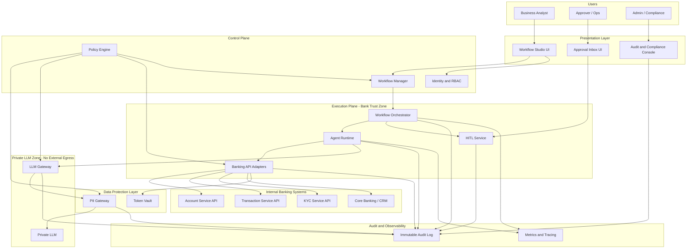

---

## 3. Layered Architecture

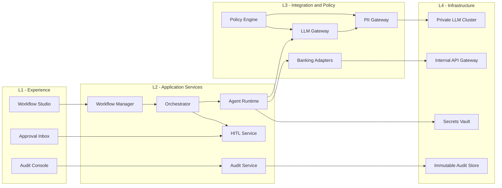

---

## 4. Core Components

### 4.1 Workflow Studio (for Business Analysts)

- **Visual canvas**: drag-and-drop nodes and edges with conditions
- **Governed node library**:
  - Start, End
  - Call Banking API (Account, Transaction, KYC)
  - Agent Step (reasoning plus tools)
  - Decision / Branch
  - Human Approval
  - Notification
  - Wait / Timer
  - Parallel / Join
- **Workflow lifecycle**: Draft, Validate, Simulate, Publish, Version
- **Simulation mode**: mock or synthetic data only (no production PII)
- **Schema validation**: each node bound to approved API contracts

### 4.2 Workflow Orchestrator

- Executes published workflows as **stateful DAGs**
- Recommended: **Temporal** or **Camunda 8**
- Responsibilities:
  - Step scheduling and retries
  - Correlation and workflow instance ID
  - Pause and resume at HITL nodes
  - Compensation or rollback where applicable

### 4.3 Agent Runtime

- Runs **agentic steps** inside the trust zone
- Pattern: Planner, Tool selection, Tool execution, Observation loop
- Tools are **never free-form HTTP** — only registered banking adapters
- Agent receives redacted context and structured tool outputs only

### 4.4 Banking API Adapter Layer

| Adapter | Example operations | Notes |
|---------|-------------------|-------|
| Account Adapter | get balance, profile summary, list accounts | Returns tokenized IDs outward |
| Transaction Adapter | search transactions, flag suspicious, get aggregates | Aggregates preferred over raw rows to LLM |
| KYC Adapter | get KYC status, document verification state | Status enums only to LLM |

All calls use mTLS or OAuth, idempotency keys, rate limits, and schema validation.

### 4.5 PII Gateway

**Mandatory gate on every LLM path.**

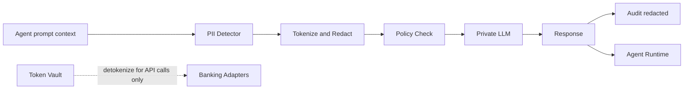

Rules:

- **Outbound to LLM**: redact or tokenize mandatory fields
- **Inbound from LLM**: scan for accidental PII generation
- **Detokenization**: only in adapter layer, never in LLM layer
- **Block and alert** on any policy violation

### 4.6 Human-in-the-Loop Service

- Creates **approval tasks** with redacted context package
- Assigns by role, team, risk level, amount threshold
- Supports approve, reject, request info, reassign, escalate
- SLA timers and escalation paths
- Workflow **pauses** until decision received

### 4.7 Audit and Compliance Service

- **Append-only**, tamper-evident storage
- Records:
  - Who published, ran, or approved
  - Workflow definition version hash
  - Step inputs and outputs (redacted)
  - API calls (endpoint, correlation ID — not raw payloads)
  - LLM request metadata (token counts, model version — not raw prompts with PII)
  - Policy decisions (allow, deny, redact)
- Retention aligned with banking regulations (e.g. 7 to 10 years)

---

## 5. Workflow Metamodel

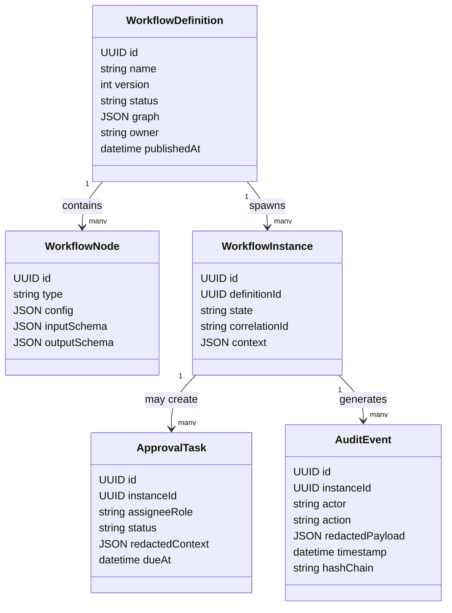

---

## 6. Example Workflow — KYC Exception Review

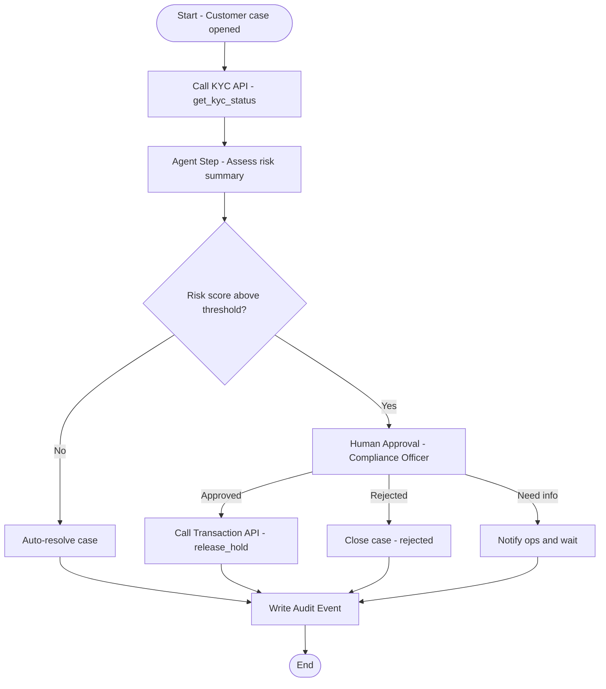

---

## 7. Sequence Diagram — End-to-End Execution

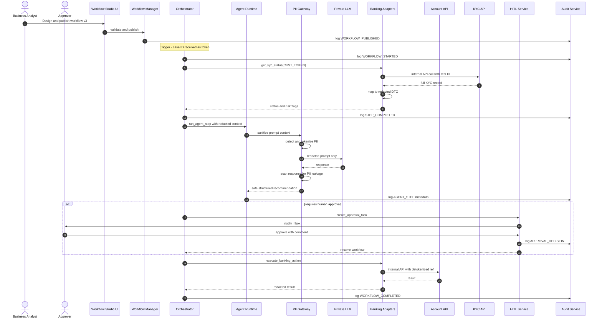

---

## 8. PII and Data Boundary Architecture

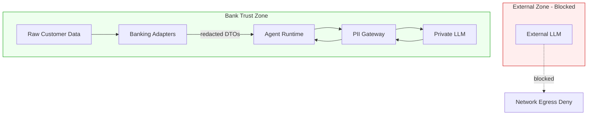

**Enforcement layers (defense in depth):**

1. **Network**: LLM subnet has no internet egress
2. **Policy Gateway**: blocks non-redacted payloads
3. **Schema contracts**: adapters return redacted DTOs only
4. **Runtime guard**: agent tools cannot bypass adapters
5. **Audit and alerts**: any policy violation triggers block and incident

---

## 9. Human-in-the-Loop State Machine

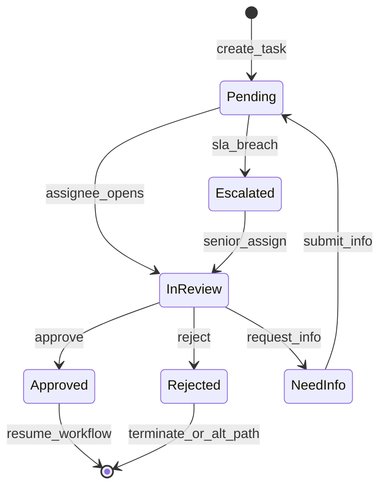

**Approval task payload (what approver sees):**

- Customer token (not raw ID)
- Workflow name and version
- Redacted summary from agent
- Risk flags and amounts (masked if needed)
- Recommended action and rationale
- Full audit trail link

---

## 10. Audit Logging Architecture

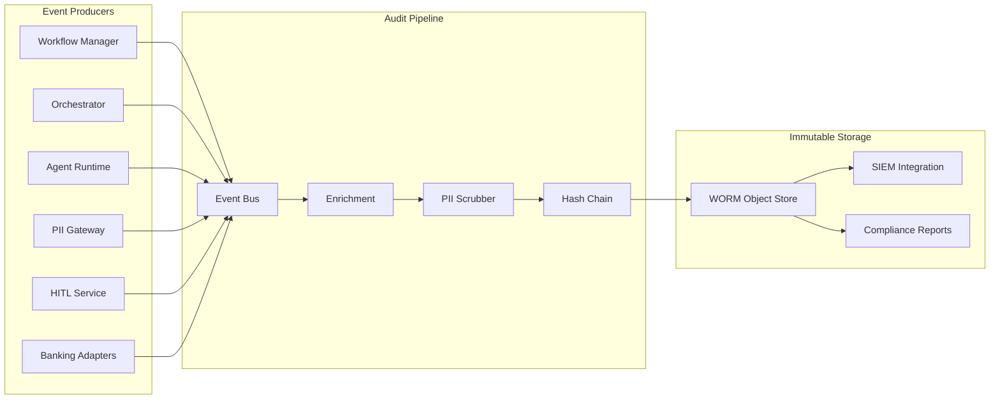

**Every audit event includes:**

`event_id | timestamp | actor | action | workflow_id | instance_id | step_id | definition_version | redacted_payload | prev_hash`

---

## 11. Deployment Topology

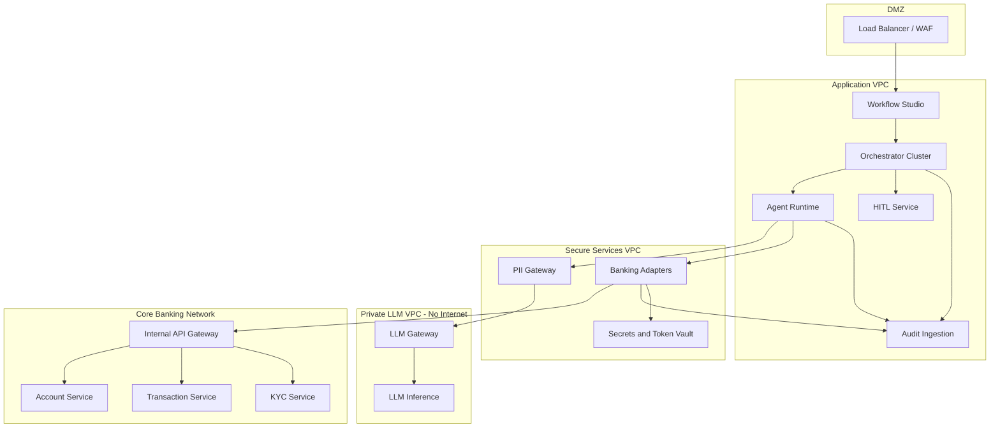

---

## 12. Technology Recommendations

| Layer | Options |
|-------|---------|
| Workflow Studio UI | React plus React Flow or Rete.js |
| Orchestrator | Temporal (recommended) or Camunda 8 |
| Agent Runtime | Python or Go service with tool registry |
| Private LLM | On-prem GPU plus vLLM, or Azure OpenAI in private VNet |
| PII Gateway | Custom plus Presidio or proprietary NER |
| Event bus | Kafka |
| Audit store | Append-only DB plus WORM S3 or immudb |
| Identity | OIDC or SAML via bank IdP |
| Secrets | HashiCorp Vault |
| API integration | Internal Kong or Apigee plus mTLS |

---

## 13. Non-Functional Requirements

| NFR | Target |
|-----|--------|
| Availability | 99.9% or higher for execution plane |
| Workflow durability | Zero lost state on crash (orchestrator-backed) |
| Approval SLA | Configurable per workflow (e.g. 4h or 24h) |
| Audit completeness | 100% of state transitions logged |
| PII leakage | Zero raw PII to external LLM (network plus policy enforced) |
| RTO / RPO | Align with bank BCP standards |
| Multi-tenancy | Optional business unit isolation |

---

## 14. Phased Delivery Roadmap

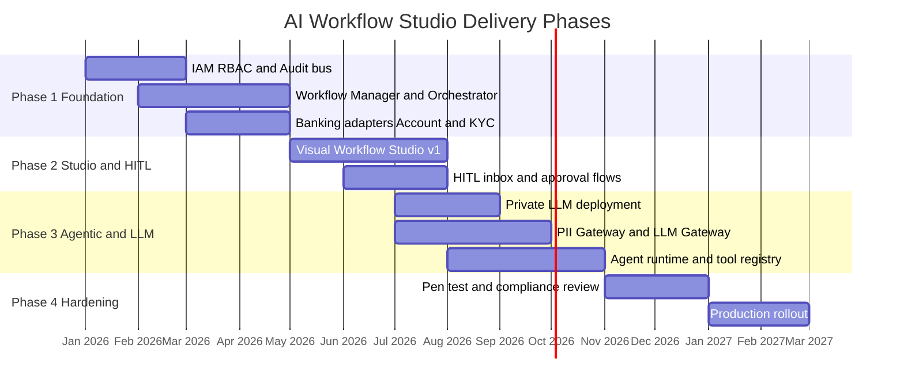

---

## 15. Key Architecture Decisions

| Decision | Choice | Rationale |
|----------|--------|-----------|
| LLM location | Private only | Regulatory and PII constraint |
| PII strategy | Tokenize and redact at gateway | Defense in depth, not prompt-only |
| Orchestration | Durable workflow engine | HITL pause and resume, retries, audit |
| BA tooling | Governed node library | Prevent unsafe API or LLM combinations |
| Audit | Immutable append-only | Banking compliance |
| Agent tools | Registered adapters only | No arbitrary API access |

---

## 16. Component Reference

| Component | Responsibility |
|-----------|----------------|
| Workflow Studio UI | Visual design, validation, simulation, publish |
| Workflow Manager | Versioning, schema checks, deployment |
| Orchestrator | Durable step execution, timers, HITL pause |
| Agent Runtime | Planner loop, tool calls, structured outputs |
| PII Gateway | Detect, tokenize, redact, block violations |
| LLM Gateway | Model routing, guardrails, request logging |
| Banking Adapters | Internal API integration, detokenization |
| HITL Service | Approval tasks, SLA, escalation |
| Audit Service | Immutable event ingestion and query |
| Policy Engine | RBAC, field allowlists, workflow governance |

---

## 17. Related Documents

- Threat model (STRIDE) — recommended next artifact
- API specification for workflow definition and execution
- Data classification and redaction policy matrix
- Compliance mapping (PCI, GDPR, local banking regulations)
