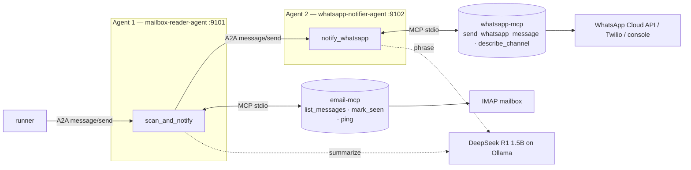

# llm-agent-a2a-demo

Two agents that talk to each other over the **A2A protocol**. Agent 1 reads a
mailbox, agent 2 sends a WhatsApp notification about each message — flagging
anything that mentions **job**, **opportunity**, **opening** or **position** as
top priority. Both agents reach their outside world through **MCP** tool servers
and reason with **DeepSeek R1 1.5B** running on **Ollama in Docker**.



Agent 1 never sends WhatsApp messages and agent 2 never reads mail. The only
thing crossing between them is an A2A message, so putting them on separate
machines is a config change, not a code change.

## Quick start

Runs end to end with **no credentials**: the default config reads
`data/sample_emails.json` and prints the WhatsApp messages to the console.

```bash
docker compose up -d
```

```bash
uv venv && uv pip install -e '.[dev]'
```

```bash
cp config/config.example.yaml config/config.yaml
```

```bash
.venv/bin/python -m mail_a2a.runner --check
```

```bash
.venv/bin/python -m mail_a2a.runner
```

The first `docker compose up` pulls DeepSeek R1 1.5B (~1.1 GB) into a named
volume; the `ollama-pull` sidecar exits once the model is ready.

### What a run looks like

```
--- TOP PRIORITY WhatsApp -> 971568896895 ---
🚩 *TOP PRIORITY* (position)
📧 *New email*
*From:* Priya Raman <priya.raman@northwind-talent.com>
*Subject:* Senior Backend Engineer position at Northwind
*Received:* 2026-08-16T09:12:00+04:00
A recruiter is asking about a senior backend engineering role in Dubai.
```

The first five lines come from a fixed template; only the last line is written
by the model (see [Where the LLM is and isn't trusted](#where-the-llm-is-and-isnt-trusted)).

## Commands

| Command | What it does |
| --- | --- |
| `python -m mail_a2a.runner` | Start both agents, run one scan, exit |
| `python -m mail_a2a.runner --watch` | Scan every `poll_interval_seconds` |
| `python -m mail_a2a.runner --serve` | Keep both agents up so you can drive them yourself |
| `python -m mail_a2a.runner --check` | Health-check Ollama, the mailbox and the WhatsApp channel |
| `python -m mail_a2a.runner --config path.yaml` | Use a different config file |
| `pytest` | 62 tests, no Ollama or network required |

With `--serve` running, the agent cards are plain HTTP:

```bash
curl -s http://127.0.0.1:9101/.well-known/agent-card.json | python3 -m json.tool
```

## Configuration

Everything lives in `config/config.yaml` (start from `config.example.yaml`,
which is the fully commented reference). `config.yaml` is gitignored.

### Mailbox

```yaml
mailbox:
  provider: imap          # imap | demo
  host: imap.gmail.com
  port: 993
  username: you@gmail.com
  auth: password          # password | oauth2
  password: "your-app-password"
  folder: INBOX
  unread_only: true
  mark_seen: false        # true to flag mail read once notified
```

* **Gmail / Yahoo / Fastmail** — `auth: password` with an app password.
* **Outlook.com / Office 365** — Microsoft has disabled password LOGIN for IMAP,
  so use `auth: oauth2`. Register an app in Microsoft Entra ID with the delegated
  `IMAP.AccessAsUser.All` permission and set `oauth_client_id`. The first run
  prints a device-login code; the refresh token is then cached in
  `data/state/msal_token.json` (mode 600) and renewals are silent.
* **`provider: demo`** — reads `data/sample_emails.json`. This is the default.

Scanning uses `BODY.PEEK`, so reading your mail never marks it read. Flagging
only happens if you set `mark_seen: true`.

### WhatsApp

```yaml
whatsapp:
  provider: console       # console | meta | twilio
  to: "971568896895"      # international format, digits only, no '+'
```

* **`console`** — prints the message. Default, so a first run cannot message a
  real number by accident.
* **`meta`** — WhatsApp Cloud API. Set `meta.access_token` and
  `meta.phone_number_id`. Two things bite here, in this order:

  1. **Tokens expire.** The token on the "API Setup" page of the Meta dashboard
     is temporary and dies after **24 hours**, after which every send returns
     `OAuthException` code 190. For anything that runs unattended, create a
     **System User** in Meta Business Settings, assign it to the WhatsApp app
     with `whatsapp_business_messaging`, and generate a **permanent** token.
  2. **The 24-hour customer-care window.** Free-form `message_mode: text` only
     reaches people who messaged your business in the last 24h — otherwise you
     get code 131047. For business-initiated alerts like these, use
     `message_mode: template` with an approved template taking one body
     parameter.

  `meta.phone_number_id` is the **Phone Number ID** from WhatsApp Manager →
  API Setup. It is not the System User ID and not the WhatsApp Business Account
  ID; using either gives `code 100, subcode 33`.

  `--check` verifies both the token and the phone number ID before a scan
  starts, and send failures for codes 190 / 131047 / 131030 / 100.33 are
  reported with the fix rather than the raw payload.
* **`twilio`** — set `twilio.account_sid`, `twilio.auth_token` and
  `twilio.from_number`. Their sandbox number works for testing.

### Priority keywords

```yaml
priority_keywords: [job, opportunity, opening, position]
```

Matched case-insensitively against subject **and** body, on word boundaries and
with plural/possessive suffixes. So `openings` and `Job's` match, while
`repositioning` and `jobless` do not.

### Secrets via environment

Any config value can be overridden by an environment variable, so secrets can
stay out of the file: `MAILBOX_PASSWORD`, `WHATSAPP_TO`,
`META_WHATSAPP_ACCESS_TOKEN`, `TWILIO_AUTH_TOKEN`, `OLLAMA_BASE_URL`, and so on
(the full map is `_ENV_OVERRIDES` in [config.py](src/mail_a2a/config.py)).
Anything whose key looks like a secret is redacted before it reaches a log.

## Logging

Both sinks are configured in one place ([logging_setup.py](src/mail_a2a/logging_setup.py)):

* **console** — human-readable, via structlog's console renderer
* **`logs/agents.log`** — one JSON object per line, including the MCP
  subprocesses, so a whole run can be replayed with `jq`

```bash
jq -r 'select(.event|startswith("a2a_")) | "\(.event) \(.peer // "") \(.skill // "")"' logs/agents.log
```

Every A2A message, MCP tool call (with timings), MCP server start/stop, LLM
request and response, priority decision and WhatsApp send is recorded. MCP stdio
servers log to **stderr**, because stdout carries the protocol framing.

## Where the LLM is and isn't trusted

DeepSeek R1 1.5B is small. The design reflects that:

| Decision | Made by |
| --- | --- |
| Sender, subject, timestamp in the notification | Fixed template |
| Top-priority flag | Keyword regex in [priority.py](src/mail_a2a/priority.py) |
| One-line summary under the alert | The model |

The model is also asked whether each email is job-related, but that answer is
only **logged next to** the keyword verdict (`priority_decision`) for comparison
— it never changes the flag. If Ollama is unreachable, notifications still go
out complete, minus the summary line; set `ollama.required: true` to fail loudly
instead.

Two R1-specific notes, both handled in [llm/ollama.py](src/mail_a2a/llm/ollama.py):
requests are sent with `"think": false`, because otherwise the reasoning block
consumes the entire token budget and `message.content` comes back empty; and any
`<think>` block that still arrives inline is stripped.

## How the A2A wiring works

Each agent is a real A2A server built on `a2a-sdk`:

* an **Agent Card** at `/.well-known/agent-card.json` advertising its skills
* a **JSON-RPC** endpoint at `/` handling `message/send`
* skills that run as tasks: `working` → artifact → `completed`

Requests and results are JSON objects carried in text parts, validated at both
ends by the pydantic models in [models.py](src/mail_a2a/models.py). The client
side reads results from the task's **artifacts** only — a completed A2A task also
carries `history`, which echoes the request you just sent, and reading that back
would have each caller parsing its own payload as the peer's answer.

| | Agent 1 | Agent 2 |
| --- | --- | --- |
| Name | `mailbox-reader-agent` | `whatsapp-notifier-agent` |
| Port | 9101 | 9102 |
| Skill | `scan_and_notify` | `notify_whatsapp` |
| MCP server | `email-mcp` | `whatsapp-mcp` |

Each MCP server is spawned over stdio for the duration of a tool call, so the
log shows the complete chain — agent → MCP tool → provider → result — and a
crashed server can never outlive the call that needed it.

## Project layout

```
src/mail_a2a/
  runner.py            entry point: boots both agents, drives the scan
  a2a_common.py        agent cards, JSON-RPC app, A2A client helpers
  agents/
    mailbox_agent.py   agent 1 — scan_and_notify
    whatsapp_agent.py  agent 2 — notify_whatsapp
  mcp_servers/
    email_mcp.py       MCP tools: list_messages, mark_seen, ping
    whatsapp_mcp.py    MCP tools: send_whatsapp_message, describe_channel
  mcp_client.py        MCP client wrapper that logs every tool call
  providers/
    mailbox.py         IMAP + demo mailboxes
    msal_auth.py       XOAUTH2 device-code flow for Outlook/Office 365
    whatsapp.py        console / Meta Cloud API / Twilio channels
  llm/ollama.py        DeepSeek R1 client
  priority.py          keyword matching
  config.py            YAML + env config
  logging_setup.py     console + JSON file logging
  state.py             UIDs already notified
```

## Notes and limits

* Notified UIDs are remembered in `data/state/seen.json`, so `--watch` does not
  re-notify. Delete that file to replay.
* Inference is the slow part: roughly 10–20 s per email on CPU, two LLM calls
  per email. `--watch` on a busy mailbox will want a GPU or a smaller
  `max_emails`.
* Agent 2 trusts the `priority` flag agent 1 sends it, rather than re-deriving
  it — one place decides, and it is the one holding the configured keywords.
